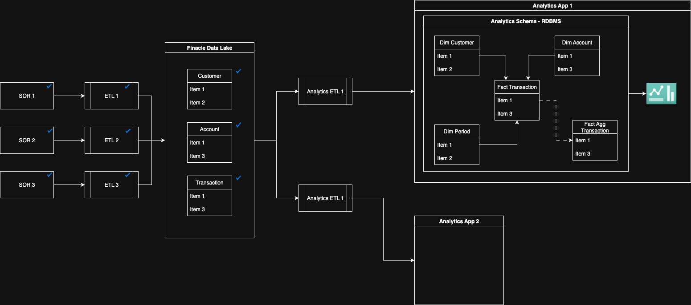

# Dashboarding

## Requirements

To provide Dashboarding capability on FBP Data including base data sourced from Finacle Core / DEH etc.

## Data Architecture

### Diagram

### SOR

Data from various `System of Record` (SOR1, SOR2, etc.) will be extracted into `Finacle Data Lake` (FDL) via `FinAqua` ETLs (ETL1, ETL2 etc.) **existing** process

#### Requirements
- FBP Microservices - can and will be SORs for example - Fee Ledger data will be sourced from Pricing Microservice
- Bank can and might choose to source data via their own mechanism
- Outliers
    - Often Excel sheets are truly valid SORs and should be treated without prejudice
    - Adjustments are often required and need to supported with approapriate data governance (Maker checker and tracking)

### ETL

Used to transform data from SOR format / system to FDL structure & database

#### Requirements
No aditional requirements on account of Analytics

### Analytics ETL

Used to transform data from SOR format / system to Analytics App's DB structure & database.

#### Requirements
- Ability to register my analytics schema in registry
- Ability to map from FDL to analytics schema with following features
    - Aggregation 
    - Transformation
    - Predicates
    - Creating dimensions (SCD 1, SCD 2) - 
- Handling of Period dimension  

### Analytics Schema

A `Star` or `Snowflake` schema datamodel to hold all the data points required for dashboarding

#### Requirements
- Data model standards and tools 
- Meta model for Data Model

### Analytics App

Visualization tool that will connect to the `Analytics Schema` will allow for dasboarding capabilities

#### Requirements
- Various widgets
- Row level data visibility
- Dashboard level access control
- RBAC (Role Based access control)
- Ability to create own dashboard
- Ability to dynamically filter on the dashboard
- Hyperlink to take user to existing FBP Screen in the same SSO tab

## Tech Stack 

- Visualization tool of choice based on 
    - requirement coverage
    - Cost (FOSS preferred)
    - popularity
    - Options
        - [Apache Superset](https://superset.apache.org)
        - [Metabase](https://www.metabase.com)
- Data Transformation Engine 
    - Spark Based
- Database
    - Hot / Warm / Cold 
    - Relational 
- Orchestration
    - FinAqua Orchestration (Apache NiFi based)
    - FBP Specific?
- Metadata Layer
    - FinAqua Data Governance [Open Metadata](https://open-metadata.org)
